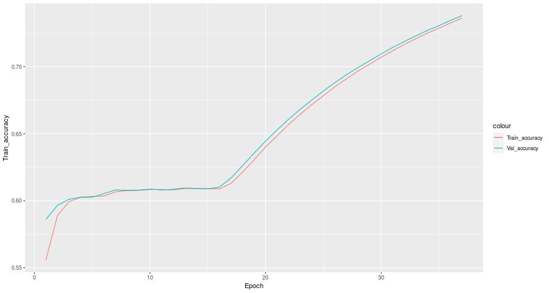
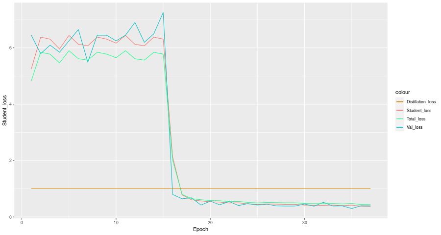

```{r setup, include=TRUE}
knitr::opts_chunk$set(echo = TRUE)
```

# Welcome

Hi everyone ! Welcome to my blog. Here I will just share some tutorials around things that were complicated for me, and for which others R users could be interested. Not surprisingly, lot of this tutorials will involve tensorflow or other deep learning things.

Sometimes things are possible in R, but, since our community is smaller, we don't have that many resources or tutorials compared to the python community, explaining why it is cubersome to do some particuliar tasks in R, especially when the few tutorials available or interfaces packages start accumulate errors or bugs because they are not used often by an active community.

I am not an expert, so I will try to source at maximum of my codes, or parameters when I can. I used a small size for the images to not blow my GPU, there is an example with fine tuning and a bigger GPU [here](https://www.kaggle.com/cdk292/knowledge-distillation-with-r-and-keras-tf).

There is probably a lack of optimization, but at least it is a working skeleton. If you have suggestion for improvement, comments are welcome :D

## About the data 

I wrote this code in the first place in the context of the [Cassava Leaf Disease Classification](https://www.kaggle.com/c/cassava-leaf-disease-classification), a Kaggle's competition where the goal was to train a model to identify the disease on leafs of cassava. Here the distillation is made from an Efficientnet0 to an other one.

# What is knowledge distillation

As presented [in this discussion thread on kaggle](https://www.kaggle.com/c/cassava-leaf-disease-classification/discussion/214959), knowledge distillation is defined as *simply trains another individual model to match the output of an ensemble.* [Source](https://www.microsoft.com/en-us/research/blog/three-mysteries-in-deep-learning-ensemble-knowledge-distillation-and-self-distillation/). It is in fact slightly more complicated : the second neural net (student) will made predictions on the images, but then, the losses will be a function of its own loss as well as a loss based on the difference between his prediction and the one of its teacher or the ensemble.

This approach allow to compress an ensemble into one model and by then reduce the inference time, or, if trained to match the output of a model, to increase the overall performance of the model. I discover this approach by looking at the top solutions of the Plant Pathology 2020 competition, an other solution with computer vision and leaf, such as [this one](https://www.kaggle.com/c/plant-pathology-2020-fgvc7/discussion/154056).

I let you go to [to this source mentioned aboved to understand how it could potentially works](https://www.microsoft.com/en-us/research/blog/three-mysteries-in-deep-learning-ensemble-knowledge-distillation-and-self-distillation/). It does not seems sure, but it seems related to the learning of specific features vs forcing the student to learn "multiple view", multiple type of feature to detect in the images. 

There is off course, no starting material to do it in R. Thanksfully there is a code example on the [website of keras](https://keras.io/examples/vision/knowledge_distillation/). In this example, they create a class of model, a distiller, to make the knowledge distillation. There is, however, one problem : **model are not inheritable in R**. There is example of inheritance with a R6 for callback, [like here](https://keras.rstudio.com/articles/training_callbacks.html), but the models are not a R6 class. To overcome this problem, I used the code example as a guide, and reproduced the steps by following the approach in this [guide for eager executation in keras with R](https://keras.rstudio.com/articles/eager_guide.html). I took other code from [the tensorflow website for R](https://tensorflow.rstudio.com/tutorials/advanced/).

**The code is quite hard to understand at first glance**. The reason is, everything is executed in a **single for loop**, since everything is done in eager mode. It did not seemed possible to do it differently. So there is a lot of variable around to collect metrics during training. If you want to understand the code just remove it from the loop and run it outside of the for loop, before reconstructing the loop around. I did not used tfdataset as shown on the guide for eager execution, so instead of make_iterator_one_shot() and iterator_get_next(), here we loop over the train_generator to produce the batches.

```{r}
library(tidyverse)
library(tensorflow)
tf$executing_eagerly()
```

```{r}
tensorflow::tf_version()
```

Here I flex with my own version of keras. Basically, it is a fork with application wrapper for the efficient net.

**Disclaimer : I did not write the code for the really handy applications wrappers.** It came [from this commit](https://github.com/rstudio/keras/commit/c406ec55f7bb2864ac58a17f963448810a531c18) for which the PR is hold until the fully release of tf 2.3, as stated [in this PR](https://github.com/rstudio/keras/pull/1097). I am not sure why the PR is closed.

```{r}
devtools::install_github("Cdk29/keras", dependencies = FALSE)
```

```{r}
library(keras)
```

```{r}
labels<-read_csv('train.csv')
head(labels)
```

```{r}
levels(as.factor(labels$label))
```

```{r}
idx0<-which(labels$label==0)
idx1<-which(labels$label==1)
idx2<-which(labels$label==2)
idx3<-which(labels$label==3)
idx4<-which(labels$label==4)
```

```{r}
labels$CBB<-0
labels$CBSD<-0
labels$CGM<-0
labels$CMD<-0
labels$Healthy<-0
```

```{r}
labels$CBB[idx0]<-1
labels$CBSD[idx1]<-1
labels$CGM[idx2]<-1
labels$CMD[idx3]<-1
```

"Would it have been easier to create a function to convert the labelling ?" You may ask.

```{r}
labels$Healthy[idx4]<-1
```

Probably.

```{r}
#labels$label<-NULL
```

```{r}
head(labels)
```

```{r}
val_labels<-read_csv('validation_set.csv')
```

```{r}
train_labels<-labels[which(!labels$image_id %in% val_labels$image_id),]
```

```{r}
table(train_labels$image_id %in% val_labels$image_id)
```

```{r}
train_labels$label<-NULL
val_labels$label<-NULL

head(train_labels)
head(val_labels)
```

```{r}
image_path<-'cassava-leaf-disease-classification/train_images/'
```

```{r}
#data augmentation
datagen <- image_data_generator(
  rotation_range = 40,
  width_shift_range = 0.2,
  height_shift_range = 0.2,
  shear_range = 0.2,
  zoom_range = 0.5,
  horizontal_flip = TRUE,
  fill_mode = "reflect"
)
```

```{r}
img_path<-"cassava-leaf-disease-classification/train_images/1000015157.jpg"

img <- image_load(img_path, target_size = c(448, 448))
img_array <- image_to_array(img)
img_array <- array_reshape(img_array, c(1, 448, 448, 3))
img_array<-img_array/255
# Generated that will flow augmented images
augmentation_generator <- flow_images_from_data(
  img_array, 
  generator = datagen, 
  batch_size = 1 
)
op <- par(mfrow = c(2, 2), pty = "s", mar = c(1, 0, 1, 0))
for (i in 1:4) {
  batch <- generator_next(augmentation_generator)
  plot(as.raster(batch[1,,,]))
}
par(op)
```

## Data generator

Okay so here is an interresting thing, I will try to compress the code to call a train generator to make it easier to call it. 

Why ? Well, apparently a generator does not yield infinite batches, and the for loop of the distiller will stop working without obvious reason at epoch 7, when reaching the end of the validation generator.

When we iterate over it, validation_generator yeld 8 images and 8 label, until the batch 267, than contains only 5 images (and create the bug when we try to add the loss of the batch to the loss of the epoch. Batch 268 does not exist. So solution seems to recreate on the fly the validation set and restart the iterations.

```{r}
arg.list <- list(dataframe = val_labels, directory = image_path,
                                              class_mode = "other",
                                              x_col = "image_id",
                                              y_col = c("CBB","CBSD", "CGM", "CMD", "Healthy"),
                                              target_size = c(228, 228),
                                              batch_size=8)
```

```{r warning=FALSE}
validation_generator <- do.call(flow_images_from_dataframe, arg.list)
```

```{r}
dim(validation_generator[266][[1]])
```

```{r}
dim(validation_generator[267][[1]])
```

```{r}
dim(val_labels)
```

```{r}
2141/8
```

```{r warning=FALSE}
train_generator <- flow_images_from_dataframe(dataframe = train_labels, 
                                              directory = image_path,
                                              generator = datagen,
                                              class_mode = "other",
                                              x_col = "image_id",
                                              y_col = c("CBB","CBSD", "CGM", "CMD", "Healthy"),
                                              target_size = c(228, 228),
                                              batch_size=8)

validation_generator <- flow_images_from_dataframe(dataframe = val_labels, 
                                              directory = image_path,
                                              class_mode = "other",
                                              x_col = "image_id",
                                              y_col = c("CBB","CBSD", "CGM", "CMD", "Healthy"),
                                              target_size = c(228, 228),
                                              batch_size=8)
```

```{r}
train_generator
```

```{r warning=FALSE}
conv_base<-keras::application_efficientnet_b0(weights = "imagenet", include_top = FALSE, input_shape = c(228, 228, 3))

freeze_weights(conv_base)

model <- keras_model_sequential() %>%
    conv_base %>% 
    layer_global_max_pooling_2d() %>% 
    layer_batch_normalization() %>% 
    layer_dropout(rate=0.5) %>%
    layer_dense(units=5, activation="softmax")
```

```{r}
#unfreeze_weights(model, from = 'block5a_expand_conv')
unfreeze_weights(conv_base, from = 'block5a_expand_conv')
```

```{r}
model %>% load_model_weights_hdf5("fine_tuned_eff_net_weights.15.hdf5")
```

```{r}
summary(model)
```

```{r}
conv_base_student<-keras::application_efficientnet_b0(weights = "imagenet", include_top = FALSE, input_shape = c(228, 228, 3))

freeze_weights(conv_base_student)

student <- keras_model_sequential() %>%
    conv_base_student %>% 
    layer_global_max_pooling_2d() %>% 
    layer_batch_normalization() %>% 
    layer_dropout(rate=0.5) %>%
    layer_dense(units=5, activation="softmax")

student
```

## Source code and knowledge distillation

Source code for knowledge distillation with Keras : https://keras.io/examples/vision/knowledge_distillation/  
Help for eager executation details in R and various usefull code : https://keras.rstudio.com/articles/eager_guide.html  
Other source code in R : https://tensorflow.rstudio.com/tutorials/advanced/

I am using an alpha parameter of 0.9 as suggested by this [article](https://openaccess.thecvf.com/content_ICCV_2019/papers/Cho_On_the_Efficacy_of_Knowledge_Distillation_ICCV_2019_paper.pdf).

```{r}
i=1
alpha=0.9 #On_the_Efficacy_of_Knowledge_Distillation_ICCV_2019
temperature=3
```

```{r}
optimizer <- optimizer_adam()
```

```{r}
train_loss <- tf$keras$metrics$Mean(name='student_loss')
train_accuracy <-  tf$keras$metrics$CategoricalAccuracy(name='train_accuracy')
```

```{r}
nb_epoch<-12
```

```{r}
nb_batch<-300
val_step<-40
```

```{r}
train_loss_plot<-c()
accuracy_plot<-c()
distilation_loss_plot <- c()
```

```{r}
val_loss_plot <- c()
val_accuracy_plot <- c()
```

```{r}
count_epoch<-0
```

```{r warning=FALSE}
for (epoch in 1:nb_epoch) {
    cat("Epoch: ", epoch, " -----------\n")
    # Init metrics
    train_loss_epoch <- 0
    accuracies_on_epoch <- c()
    distilation_loss_epoch <- 0
    val_loss_epoch <- 0
    val_accuaries_on_epoch <- c()
    
    #Formula to not see the same batch over and over on each epoch
    #Count epoch instead of epoch
    count_epoch<-count_epoch+1
    idx_batch <- (1+nb_batch*(count_epoch-1)):(nb_batch*count_epoch)
    idx_val_set <- (1+val_step*(count_epoch-1)):(val_step*count_epoch)
    
    #Dirty solution to restart on a new validation batch generator before reaching the end of the other one 
    if (as.integer((dim(val_labels)[1]/8)-1) %in% idx_val_set) {
        count_epoch<-1
        idx_val_set <- (1+val_step*(count_epoch-1)):(val_step*count_epoch)
        validation_generator <- do.call(flow_images_from_dataframe, arg.list)
    }
    #need the same if for train generator
    if (as.integer((dim(train_labels)[1]/8)-1) %in% idx_batch) {
        count_epoch<-1
        idx_batch <- (1+nb_batch*(count_epoch-1)):(nb_batch*count_epoch)
        train_generator <- do.call(flow_images_from_dataframe, arg.list)
    }
    
    for (batch in idx_batch) {
        x = train_generator[batch][[1]]
        y = train_generator[batch][[2]]
        # Forward pass of teacher
        teacher_predictions = model(x)

        with(tf$GradientTape() %as% tape, {
            student_predictions = student(x)
            student_loss = tf$losses$categorical_crossentropy(y, student_predictions)
        
            distillation_loss = tf$losses$categorical_crossentropy(tf$nn$softmax(teacher_predictions/temperature, axis=0L), 
                                                           tf$nn$softmax(student_predictions/temperature, axis=0L))
        
            loss = alpha * student_loss + (1 - alpha) * distillation_loss
            })
        
        # Compute gradients
        # Variating learning rate :
        # optimizer <- optimizer_adam(lr = 0.0001)
        gradients <- tape$gradient(loss, student$trainable_variables)
        optimizer$apply_gradients(purrr::transpose(list(gradients, student$trainable_variables)))
        
        #Collect the metrics of the student
        train_loss_epoch <- train_loss_epoch + student_loss
        distilation_loss_epoch <- distilation_loss_epoch + distillation_loss
        
        accuracy_on_batch <- train_accuracy(y_true=y, y_pred=student_predictions)
        accuracies_on_epoch <- c(accuracies_on_epoch, as.numeric(accuracy_on_batch))
        
    }

    #Collect info on current epoch and for graphs and cat()
    train_loss_epoch <- mean(as.vector(as.numeric(train_loss_epoch))/nb_batch)
    train_loss_plot <- c(train_loss_plot, train_loss_epoch)
    
    distilation_loss_epoch <- mean(as.vector(as.numeric(distilation_loss_epoch))/nb_batch)
    distilation_loss_plot <- c(distilation_loss_plot, distilation_loss_epoch)
    
    accuracies_on_epoch <- mean(accuracies_on_epoch)
    accuracy_plot <- c(accuracy_plot, accuracies_on_epoch)
    
    
    for (step in idx_val_set) {
        # Unpack the data
        x = validation_generator[step][[1]]
        y = validation_generator[step][[2]]

        # Compute predictions
        student_predictions = student(x)

        # Calculate the loss
        student_loss = tf$losses$categorical_crossentropy(y, student_predictions)

        #Collect the metrics of the student
        #This line will create a bug of shape when val_loss end.
        val_loss_epoch <- val_loss_epoch + student_loss
        
        accuracy_on_val_step <- train_accuracy(y_true=y, y_pred=student_predictions)
        val_accuaries_on_epoch <- c(val_accuaries_on_epoch, as.numeric(accuracy_on_val_step))
    }
    
    #Collect info on current epoch and for graphs and cat()
    val_loss_epoch <- mean(as.vector(as.numeric(val_loss_epoch))/val_step)
    val_loss_plot <- c(val_loss_plot, val_loss_epoch)
    
    val_accuaries_on_epoch <- mean(val_accuaries_on_epoch)
    val_accuracy_plot <- c(val_accuracy_plot, val_accuaries_on_epoch)
    
    #Plotting
    cat("Total loss (epoch): ", epoch, ": ", train_loss_epoch, "\n")
    cat("Distillater loss : ", epoch, ": ", distilation_loss_epoch, "\n")
    cat("Accuracy (epoch): ", epoch, ": ", accuracies_on_epoch, "\n")
    cat("Val loss : ", epoch, ": ", val_loss_epoch, "\n")
    cat("Val Accuracy (epoch): ", epoch, ": ", val_accuaries_on_epoch, "\n")
}
```

What about global_step = tf.train.get_or_create_global_step() describe [here](https://keras.rstudio.com/articles/eager_guide.html) ? It seems to only refers to the number of batches seen by the graph. [Source](https://stackoverflow.com/questions/41166681/what-does-global-step-mean-in-tensorflow).

## Plotting

```{r}
total_loss_plot<-c()
```

```{r}
#instead of collecting them during the training : 
total_loss_plot <- alpha * train_loss_plot + (1 - alpha) * distilation_loss_plot
```

```{r}
data <- data.frame("Student_loss" = train_loss_plot, 
                    "Distillation_loss" = distilation_loss_plot,
                   "Total_loss" = total_loss_plot,
                    "Epoch" = 1:length(train_loss_plot),
                    "Val_loss" = val_loss_plot,
                    "Train_accuracy"= accuracy_plot,
                    "Val_accuracy"= val_accuracy_plot)
```

```{r}
head(data)
```

Where total_loss is alpha * train_loss_plot * (1 - alpha) * distilation_loss_plot

```{r}
ggplot(data, aes(Epoch)) +
  scale_colour_manual(values=c(Student_loss="#F8766D",Val_loss="#00BFC4", Distillation_loss="#DE8C00", Total_loss="#1aff8c")) +
  geom_line(aes(y = Student_loss, colour = "Student_loss")) + 
  geom_line(aes(y = Val_loss, colour = "Val_loss")) + 
  geom_line(aes(y = Total_loss, colour = "Total_loss")) + 
  geom_line(aes(y = Distillation_loss, colour = "Distillation_loss"))
#Validation set
ggplot(data, aes(Epoch)) + 
  geom_line(aes(y = Train_accuracy, colour = "Train_accuracy")) + 
  geom_line(aes(y = Val_accuracy, colour = "Val_accuracy"))
```


# Fine tuning and conclusion

Is that all ? Well, no. Here we perform knowledge distillation to teach to the head of the student network.

The next step would be to reproduce the knowledge distillation after unfreezing some part of the student, after writing something like :

```{r}
unfreeze_weights(conv_base_student, from = 'block5a_expand_conv')
```

But I will not bet my small GPU card on this or start a fire in my basement for the sake of the tutorial.

As I mentioned earlier,
[I readapted my code from kaggle, where the gpu is much bigger](https://www.kaggle.com/cdk292/knowledge-distillation-with-r-and-keras-tf/). Take a look if you want to see, but basically the end output looks like this :






Well, that's it for this post, which is probably already lengthy enough for a blog post !
