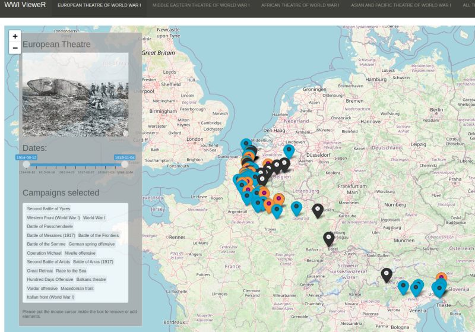

```{r setup, include=FALSE}
knitr::opts_chunk$set(echo = TRUE)
```



# WWI VieweR

Hi everyone ! Long time no see. I recently undertook to validate the capstone project of the [Data Visualization specialization of the Johns Hopkins University on Coursera](https://www.coursera.org/specializations/jhu-data-visualization-dashboarding-with-r), with something that was probably a slight overkill for the requirements. Beeing without any idea around the 10th November, I came up with the idea of visualizing the battles of the first world war the 11th.

The app is hosted here : https://cdk296.shinyapps.io/WWI_VieweR/ and the code of the application and of the scrapping is accessible [on this github repo.](https://github.com/Cdk29/Capstone_project) The structure of the repo is somewhat messy because of the structuring of the course in different weeks.

I ended up carrying this project quite longer than I expected (cf the date of this blog post). I also learnt some things that I did not expected to learn, such as how to query Dbpedia using SPARQL with the help of ten years old R-bloggers posts. I discovered some battles and fronts. Also, even if you know that the war had a huge impacts on the societies of the time, plotting the percentage of death per population certainly help to grasp what this could have means for the contemporaries.

I also discovered that, when you are french and start by plotting the battles of the western front, the current map of the world provided by leaflet works very well, since boundaries did not changed since one century. When you start plotting the battles of other fronts, such as the middle east, it became quickly out-of-context. I remember that T.E. Lawrence mentioned Mesopotamia and probably Persia in his book, countries you will have trouble to find now on a map.

## Data:

I originally started with the [CDB90](https://github.com/jrnold/CDB90) dataset, planning to recover the latitude and longitude for each battle from Dbpedia. But the URLs links inside the battles.csv where somewhat too old, and query using them were not working.

I ended up querying directly dbpedia, using the code in the file Week_2.Rmd and scrapping_all_ww1.Rmd (the file is named Week_2 because of the segmentation of the capstone project course on Coursera)/

See [the github repo.](https://github.com/Cdk29/Capstone_project)

## Some Data limitation

Facts in history are not that objective or simple. For exemple, is a battle a victory or not ? Take for example the  [Battle of Jutland](https://en.wikipedia.org/wiki/Battle_of_Jutland), both camps claimed victory, because they were pursuing differents objectives.

Also, some results of battle may vary depending the language used for scrapping *(for the second world war I remember that the protagonist of the liberation of Rome is somewhat different based on the langage consulted ;p)*.

Regarding the scrapping, I am pretty sure some battles are missings, for exemple in the eastern front of the war. Not sure why.

Also, the map where I mapped the battles is a contemporary map. Too bad there is not a world map of 1914 accessible on Leafleat.

